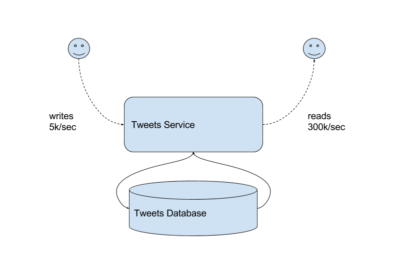
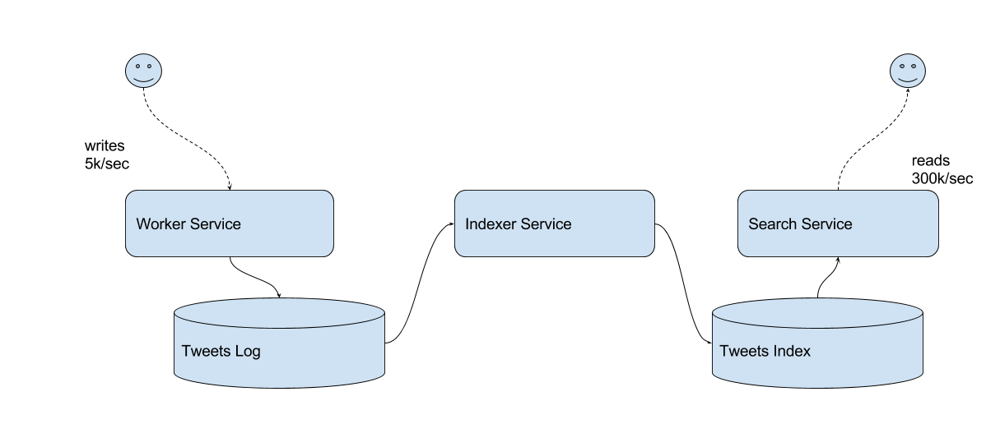

## Demo: 'Tweets' Application Re-Design

So, now that we have an clearer understanding about what is Observability,
how can we instrument our applications, and what distributed tracing means,
we can move into a more insteresting use-case.

Here I will present a demo application, that will present an applications 
that we can call "Trending Tweets".

Basically we will be able to poll tweets based on topics, and then we will
be able to query the latest tweets. So we have a write side and a read side.

Now, the first service design is as follows:

We have 1 service on charge of reads and writes, using a relational database as 
data store.

Our data more is simple: 1 user have multiple Tweets, and 1 Tweet has multiple 
Hashtags.

Let's analyze this scenario and then move to a distributed scenario where
we use a data pipeline to isolate the reads from the writes.

Sounds good?

### Lab 01: Tweets Service v1

### Lab 02: Generate Write Load

### Lab 03: Evaluate Load

### Lab 04: Generate Query Load

### Lab 05: Find issues

### Lab 06: Tweets Service v2

### Lab 07: Evaluate Load

### Lab 08: Generate Query Load
