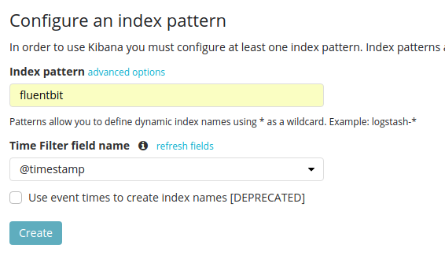

## Logging

Logging help you to register events from your application
to some kind of output (e.g. file, stout, log aggregator)

It is a very useful tool but sometimes we could abuse using it.

You could find it that useful that you could say: 
'What harm would it make to log every request payload?'
Well, it could cause issues eventually: if the log framework 
logs to a file it could lock to wait the for the file to be available.
So, long story short: use it with caution (as any other instrumentation).

Here are a couple of posts about what could go wrong about logs
and when actually use it:

* [https://peter.bourgon.org/blog/2016/02/07/logging-v-instrumentation.html](https://peter.bourgon.org/blog/2016/02/07/logging-v-instrumentation.html) 
* [https://blog.codinghorror.com/the-problem-with-logging/](https://blog.codinghorror.com/the-problem-with-logging/)

### Lab 01: Logs on a Simple Monolith

Logs are very easy to use, and very easy to misuse, so let's take a look
how to use it:

1. Build your hello-world-monolith containers, using the following 
command:

```bash
./mvnw clean package -pl hello-world-monolith
```

This will package the application, and then let's build and start 
the container:

```bash
docker-compose -f hello-world.yml build
docker-compose -f hello-world.yml up -d
```

Once the container is started, let's check the logs:

```bash
docker-compose -f hello-world.yml logs -f 
...
hello-world-monolith_1  | INFO  [2017-11-22 22:12:14,884] org.eclipse.jetty.server.handler.ContextHandler: Started i.d.j.MutableServletContextHandler@d675f9f{/,null,AVAILABLE}
hello-world-monolith_1  | INFO  [2017-11-22 22:12:14,892] org.eclipse.jetty.server.AbstractConnector: Started application@61dde151{HTTP/1.1,[http/1.1]}{0.0.0.0:8080}
hello-world-monolith_1  | INFO  [2017-11-22 22:12:14,892] org.eclipse.jetty.server.AbstractConnector: Started admin@b25b095{HTTP/1.1,[http/1.1]}{0.0.0.0:8081}
hello-world-monolith_1  | INFO  [2017-11-22 22:12:14,892] org.eclipse.jetty.server.Server: Started @1859ms
```

Here we can check the logging it is usually part of every software,
in this case, docker is taking care of the standard output produced 
by the application and storing it into a file.

If we test the application from the outside we can see that an event 
will be printed:

```bash
docker-compose -f hello-world.yml ps
curl http://docker-vm:8080/hello/jeqo
> Hello jeqo
```

If we go to the logs from Docker:

```bash
docker-compose -f hello-world.yml logs -f 
...
hello-world-monolith_1  | 192.168.42.1 - - [22/Nov/2017:22:16:05 +0000] "GET /hello/jeqo HTTP/1.1" 200 10 "-" "curl/7.47.0" 81
```

The access log gives pretty useful information about the events. 
So, logs are great, it help in this case, I have one container, 
so I can check the file and validate that something has happened.

The problem is that if we start to generate some load, checking the log
could get a bit cumbersome, but if our application is simple enough
it should be ok to rely on this source to validate what is going on.

In this case, if we check the source code, the translation service 
and the hello world service are both part of the same application.

### Lab 02: Logs on a Distributed Application

What if we decide to distribute our monolith? What if we decide to 
put a front end client, then the hello service as a `micro-service`,
and the translation service on another container?

Things start to become more complex right?

Let's start to the distributed application:

```bash
./mvnw clean package -pl hello-world-distributed/ -amd
docker-compose -f hello-world.distributed.yml build
docker-compose -f hello-world.distributed.yml up -d
```

Now, let's check the logs to validate if everything is fine:

```bash
docker-compose -f hello-world.distributed.yml logs -f
```

A bit more complex right?

Let's call the client to check how logs go:

```bash
docker-compose -f hello-world.distributed.yml ps hello-world-client
curl http://docker-vm:32918/greetings/jeqo?lang=it
```

This is how services depend on each other: 
`client -> service -> translation`

But understanding how they behave without checking the source code,
could be a challenge. Actually there is no other way. 
That is what happened to me, only developers with experience on the
different components or the actual developers are the only ones to 
know what is going on. 

What if we scale one of the components? how do we know what is going
on? which containers has been part of a transaction?

```bash
docker-compose -f hello-world.distributed.yml scale hello-world-service=5
docker-compose -f hello-world.distributed.yml ps
             Name                           Command                           State                            Ports              
---------------------------------------------------------------------------------------------------------------------------------
talkdistributedtracingnoslides   java -jar hello-translatio ...   Up                               0.0.0.0:32917->8080/tcp,       
_hello-translation-service_1                                                                       8081/tcp                       
talkdistributedtracingnoslides   java -jar hello-world-clie ...   Up                               0.0.0.0:32918->8080/tcp,       
_hello-world-client_1                                                                              8081/tcp                       
talkdistributedtracingnoslides   java -jar hello-world-serv ...   Up                               0.0.0.0:32919->8080/tcp,       
_hello-world-service_1                                                                             8081/tcp                       
talkdistributedtracingnoslides   java -jar hello-world-serv ...   Up                               0.0.0.0:32920->8080/tcp,       
_hello-world-service_2                                                                             8081/tcp                       
talkdistributedtracingnoslides   java -jar hello-world-serv ...   Up                               0.0.0.0:32921->8080/tcp,       
_hello-world-service_3                                                                             8081/tcp                       
talkdistributedtracingnoslides   java -jar hello-world-serv ...   Up                               0.0.0.0:32923->8080/tcp,       
_hello-world-service_4                                                                             8081/tcp                       
talkdistributedtracingnoslides   java -jar hello-world-serv ...   Up                               0.0.0.0:32922->8080/tcp,       
_hello-world-service_5
```

```bash
curl http://docker-vm:32918/greetings/eliana?lang=es
docker-compose -f hello-world.distributed.yml logs -f 
...
hello-world-service_3        | 192.168.224.4 - - [22/Nov/2017:22:49:31 +0000] "GET /hello-world/eliana?lang=es HTTP/1.1" 200 11 "-" "Apache-HttpClient/4.5.3 (Java/1.8.0_152)" 123
...
```

One solution for this would be to aggregate and index logs on a 
repository.

Let's check how we can do that:

If we go to: [https://12factor.net/logs](https://12factor.net/logs) (factors of a Cloud Native 
application)

> A twelve-factor app never concerns itself with routing or storage 
of its output stream. It should not attempt to write to or manage 
log files. Instead, each running process writes its event stream, 
unbuffered, to stdout. During local development, the developer 
will view this stream in the foreground of their terminal to 
observe the app’s behavior.

How to manage the files is not a concern of the application,
we can rely on Docker or Kubernetes to handle it.

Fluentd is a project founded by the Cloud Native Computing Foundation:
https://www.fluentd.org/

And Docker, has a driver to send logs to Fluentd, so let's see how it 
looks:

```yaml
  hello-translation-service:
    build: hello-world-distributed/translation
    ports:
      - 8080
    logging:
      driver: "fluentd"
      options:
        fluentd-address: localhost:24224
```

Here, we are declaring the log driver, and then defining where is the
aggregator. 

Let's define it on all the services to see how it works:

```bash
docker-compose -f apm.logging.yml up -d
docker-compose hello-world.distributed.yml up -d
```

The `apm.logging.yml` file defines 3 services to aggregate, 
store and visualize logs.

Distributed services will be recreated and if we try to go
to the logs:

```bash
docker-compose -f hello-world.distributed.yml logs -f
Attaching to talkdistributedtracingnoslides_hello-world-service_1, talkdistributedtracingnoslides_hello-world-service_2, talkdistributedtracingnoslides_hello-world-service_3, talkdistributedtracingnoslides_hello-world-service_5, talkdistributedtracingnoslides_hello-world-service_4, talkdistributedtracingnoslides_hello-world-client_1, talkdistributedtracingnoslides_hello-translation-service_1
hello-world-service_1        | WARNING: no logs are available with the 'fluentd' log driver
hello-world-service_2        | WARNING: no logs are available with the 'fluentd' log driver
hello-world-service_3        | WARNING: no logs are available with the 'fluentd' log driver
hello-world-service_5        | WARNING: no logs are available with the 'fluentd' log driver
hello-world-service_4        | WARNING: no logs are available with the 'fluentd' log driver
hello-world-client_1         | WARNING: no logs are available with the 'fluentd' log driver
hello-translation-service_1  | WARNING: no logs are available with the 'fluentd' log driver
```

Every log is forwarded to Flunt bit (a lightweight aggregator), 
that then forward to Elasticsearch. To visualize the logs, we can go 
to: http://docker-vm:5601/app/kibana



Create the pattern, and then go to `Discover`, and check the logs.

Events logged grows directly proportional to the number of requests, so 
try to log just enough: Exceptions are a good starting point.

As Peter Bourgon mentioned in his blog post:

> (...) services should only log **actionable** information.

Remember, if another components should react to the events, 
instead of logging to standard output, you should put this events
into a Topic (i.e. Apache Kafka) or return it to the user if 
she/he should do something about it.

## Metrics

Metrics on the other side aggregate values based on Events. In this sense, 
one you create Metrics, only the value of these metrics will get updated,
that means much less overhead compared to logs, some we could add as 
much metrics as we find useful.

A good starting point will be following [this tweet](https://twitter.com/LindsayofSF/status/692191001692237825)
, we can use the RED method: add metrics for **R**equest rate, 
**E**rror rate, and **D**uration.

### Lab 01: Instrument with Metrics

One easy way to instrument your applications should be first check 
if your libraries/frameworks are already instrumented.

In this case, Dropwizard, the framework to deploy rest services 
already have instrumentation for metrics.

Instrument is the first step, then we need to store the information 
generated somewhere: in this case I will Prometheus, as we are
using Cloud Native Foundation projects.

Let's add the `io.prometheus:simpleclient_dropwizard` library:

```xml
        <dependency>
            <groupId>io.prometheus</groupId>
            <artifactId>simpleclient_dropwizard</artifactId>
        </dependency>
```

And instrument the application:

```java
public class HelloWorldMonolithApp extends Application<Configuration> {

  @Override
  public void run(Configuration configuration, Environment environment) throws Exception {
    //...
    //...
        
    // Add Metrics Instrumentation to count requests
    final CollectorRegistry collectorRegistry = new CollectorRegistry();
    collectorRegistry.register(new DropwizardExports(environment.metrics()));

    // Register Metrics Servlet
    environment.admin()
        .addServlet("metrics", new MetricsServlet(collectorRegistry))
        .addMapping("/metrics");
  }
}
```

And add `@Timed` annotation to instrument the HTTP Endpoint:

```java
@Path("hello")
public class GreetingResource {

  @GET
  @Path("{name}")
  @Timed //Metrics Instrumentation
  public Response hello(@PathParam("name") String name,
                        @QueryParam("lang") String lang) {
    //...
  }
}
```

Let's repackage and restart the container:

```bash
./mvnw clean package -pl hello-world-monolith/
docker-compose -f hello-world.yml build
docker-compose -f hello-world.yml up -d
docker-compose -f hello-world.yml ps
             Name                           Command                           State                            Ports              
---------------------------------------------------------------------------------------------------------------------------------
talkdistributedtracingnoslides   java -jar hello-world-mono ...   Up                               0.0.0.0:8080->8080/tcp,       
_hello-world-monolith_1                                                                            0.0.0.0:8081->8081/tcp
```

Check the Admin port forwarded (`8081`), and access the `/metrics` 
context: [http://docker-vm:32946/metrics](http://docker-vm:32946/metrics)

That endpoint expose the current values of each metric.

To store them, we need to configure Prometheus to scrape this
endpoint. Check the configuration file located on `metrics/prometheus/prometheus.yml`:

```yaml
  - job_name: 'hello-world-monolith'
    static_configs:
      - targets: ['hello-world-monolith:8081']
```

Let's build the container image, and the start the metrics containers:

```bash
docker-compose -f apm.metrics.yml build
docker-compose -f apm.metrics.yml up -d
```

If everything works correctly we can go to [http://docker-vm:9090/graph](http://docker-vm:9090/graph)
and check the number of requests:

First the increment by each 10 seconds:

```
rate(io_github_jeqo_demo_rest_GreetingResource_hello_count[10s])
```

And the total number of requests:

```
io_github_jeqo_demo_rest_GreetingResource_hello_count
```

So, we can now see the total requests and the number of transactions
per second, in periods of 10s.

