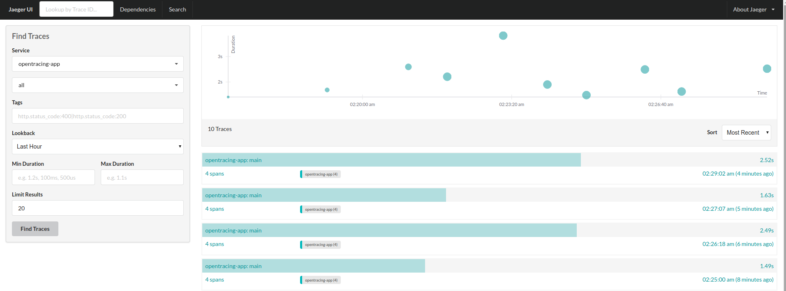

## Distributed Tracing with OpenTracing

Metrics and Logging are useful tools, and sometimes offer
enough visibility to operate our systems.

But we have also validate that when components starts to 
get distributed and scale, reason about the system and how
it behaves is more complicated, and requires time and effort 
to check logs to know the impact of a request on every component.

Tracing is a tool that helps to track a request, but if we 
are talking about a distributed system, we will need a way to 
propagate the trace context between components, so we are able
to have a trace about how a set of distributed components react
and are part of a transaction.

OpenTracing project tries to solve this offering a vendor-neutral
API to define traces.

### Lab 01: OpenTracing API - Tracer and Spans

Let's see how it works:

1. Add OpenTracing API:

```xml

    <dependencies>
        <dependency>
            <groupId>io.opentracing</groupId>
            <artifactId>opentracing-api</artifactId>
        </dependency>
        <dependency>
            <groupId>io.opentracing</groupId>
            <artifactId>opentracing-noop</artifactId>
        </dependency>
    </dependencies>
```

2. Then, let's create a `OpenTracingApp` class and instantiate a `Tracer`:

```java
public class OpenTracingApp {

  public static void main(String[] args) {
    final Tracer tracer = NoopTracerFactory.create();
    
  }
}
```

We are using a `NoopTracer` that should do nothing, we will check
an specific implementation later.

This `Tracer` will take care of creating `spans`, let's crete one:

```java
public class OpenTracingApp {

  public static void main(String[] args) {
    final Tracer tracer = NoopTracerFactory.create();

    final ActiveSpan span = tracer.buildSpan("main").startActive();
    //...
    span.close();    
  }
}
```

A `span` is just a meaningful task that you want to trace. It has
an operation name, a start and end timestamp.

Nothing special so far. 

So, let's create another Span, that will be a child of main `span`:

```java
public class OpenTracingApp {

  public static void main(String[] args) {
    final Tracer tracer = NoopTracerFactory.create();
    GlobalTracer.register(tracer);

    final ActiveSpan span = tracer.buildSpan("main").startActive();
    //...
    operation1();

    span.close();
  }

  private static void operation1() {
    final ActiveSpan span = GlobalTracer.get().buildSpan("operation1").startActive();
    //...

    span.close();
  }
}
```

Here we are using `GlobalTracer`, a utility to propagate the 
Tracer at a thread-level.

Now, we can go a bit deeper:

Each `span` can have metadata that will help use to identify them 
easily:

```java
final ActiveSpan span = GlobalTracer.get().buildSpan("operation1")
        .withTag("tag1", "value1")
        .withTag("tag2", "value2")
        .startActive();
```

Tags are `span`-specific.

Then we can log events as part of a `span`. This means each log
will have the context of the span:

```java
  private static void operation1() {
    final ActiveSpan span = GlobalTracer.get().buildSpan("operation1")
        .withTag("tag1", "value1")
        .withTag("tag2", "value2")
        .startActive();
    //...

    span.log("something happened");
    
    span.close();
  }
```

### Lab 02: OpenTracing API - SpanContext and References

What if we want to propagate the trace across Process boundaries?
This is one of the key OpenTracing features:

1. To achieve inter-process propagation, OpenTracing uses a 
concept called `SpanContext`, that contains implementation 
specific values that identity a span (e.g. by adding the 
trace id, and the span id).

```java
public class OpenTracingApp {

  public static void main(String[] args) {
    final Tracer tracer = NoopTracerFactory.create();
    GlobalTracer.register(tracer);

    final ActiveSpan span = tracer.buildSpan("main").startActive();
    //...
    SpanContext spanContext = span.context();
    operation1(spanContext);

    span.close();
  }

  private static void operation1(SpanContext spanContext) {
    final ActiveSpan span =
        GlobalTracer.get().buildSpan("operation1")
            .asChildOf(spanContext)
            .withTag("tag1", "value1")
            .withTag("tag2", "value2")
            .startActive();
    //...

    span.log("something happened");

    span.close();
  }
}
```

In this case, I am using the `SpanContext` to reference the
`main` span as the parent of `operation1` span.

A `ChildOf` reference is the basic one, when you have a client/server
interaction. For instance, the `main` is using `operation1` for
something and is part of its process.

What if we want to make a reference that is not actual part
of the parent processing? Here we can use the `FollowsFrom` reference:

```java
  public static void main(String[] args) {
    final Tracer tracer = NoopTracerFactory.create();
    GlobalTracer.register(tracer);

    final ActiveSpan span = tracer.buildSpan("main").startActive();
    //...
    SpanContext spanContext = span.context();
    
    operation1(spanContext);
    
    span.close();
    
    anotherOperation(spanContext);
  }

  private static void anotherOperation(SpanContext spanContext) {
    final ActiveSpan span =
        GlobalTracer.get().buildSpan("operation1")
            .addReference(References.FOLLOWS_FROM, spanContext)
            .withTag("tag1", "value1")
            .withTag("tag2", "value2")
            .startActive();

    span.close();
  }

```

Here `anotherOperation()` is executed after `main` span, then the
reference `FollowsFrom` represents the behavior correctly.


### Lab 03: OpenTracing API - Inter-Process propagation

What if we want to move to another process?

To do this, OpenTracing `Tracer` is in charge of `inject` and `extract`
`SpanContext` from a `Carrier`. A carrier should be an object 
that will contain the `SpanContext` values, so it can move it to 
another process. For instance, if your are calling an HTTP Resource,
you can inject and extract the `SpanContext` from the HTTP Headers.

In this case, we will use a Text Map:

```java
  public static void main(String[] args) {
    final Tracer tracer = NoopTracerFactory.create();
    GlobalTracer.register(tracer);

    final ActiveSpan span = tracer.buildSpan("main").startActive();
    //...
    SpanContext spanContext = span.context();

    operation1(spanContext);

    span.close();

    anotherOperation(spanContext);

    Map<String, String> map = new HashMap<>();
    TextMap carrier = new TextMapInjectAdapter(map);
    tracer.inject(spanContext, Format.Builtin.TEXT_MAP, carrier);
    out.println(map.toString());

    anotherProcess(map);
  }

  private static void anotherProcess(Map<String, String> map) {
    TextMap carrier = new TextMapExtractAdapter(map);
    SpanContext spanContext = GlobalTracer.get().extract(Format.Builtin.TEXT_MAP, carrier);

    final ActiveSpan span =
        GlobalTracer.get().buildSpan("main2")
            .addReference(References.FOLLOWS_FROM, spanContext)
            .withTag("tag1", "value1")
            .withTag("tag2", "value2")
            .startActive();

    span.close();
  }
```

`anotherProcess` method is simulating another process, so we can check 
how `SpanContext` is injected and extracted.

What if we want to, not only propagate the context, but also 
propagate variables? Here is where `BaggageItems` are useful:

```java
  public static void main(String[] args) {
    final Tracer tracer = NoopTracerFactory.create();
    GlobalTracer.register(tracer);

    final ActiveSpan span = tracer.buildSpan("main").startActive();
    
    span.setBaggageItem("globalKey", "globalValue");
    
    SpanContext spanContext = span.context();

    operation1(spanContext);

    span.close();

    anotherOperation(spanContext);

    Map<String, String> map = new HashMap<>();
    TextMap carrier = new TextMapInjectAdapter(map);
    tracer.inject(spanContext, Format.Builtin.TEXT_MAP, carrier);
    out.println(map.toString());

    anotherProcess(map);
  }

  private static void anotherProcess(Map<String, String> map) throws InterruptedException {
    final Tracer tracer = getTracer();
    TextMap carrier = new TextMapExtractAdapter(map);
    SpanContext spanContext = tracer.extract(Format.Builtin.TEXT_MAP, carrier);


    final ActiveSpan span =
        tracer.buildSpan("main2")
            .addReference(References.FOLLOWS_FROM, spanContext)
            .startActive();

    spanContext.baggageItems()
        .forEach(entry -> span.log("Doing something with: " + entry.getKey() + "->" + entry.getValue()));

    waitABit();

    span.close();
  }
```

### Lab 04: OpenTracing API - JaegerTracing implementation

So far we have only instrument this example, let's see how it works
with one of the OpenTracing implementations.

Let's check how Jaeger works:

1. Add library and instantiate a Tracer:

```xml
        <dependency>
            <groupId>com.uber.jaeger</groupId>
            <artifactId>jaeger-core</artifactId>
        </dependency>
```

```java

  private static Tracer getTracer() {
    try {
      return new com.uber.jaeger.Configuration(
          "opentracing-app",
          new com.uber.jaeger.Configuration.SamplerConfiguration("const", 1), //100%
          new com.uber.jaeger.Configuration.ReporterConfiguration(
              true,
              "docker-vm",
              6831,
              1000,   // flush interval in milliseconds
              10000)  /*max buffered Spans*/)
          .getTracer();
    } catch (Exception e) {
      e.printStackTrace();
      return NoopTracerFactory.create();
    }
  }
```

First of all, we define the Service name, this will be how 
Spans will get grouped. Then we define how to do sampling, in 
this case we will sample every span.
Then we need to define how to connect with the Agent. 

In this case, the agent will be in a remote host: `docker-vm:6831/udp`

Then a couple of parameters to tune the Tracer.

Let's see how it works:

```bash
docker-compose -f apm.tracing.yml up -d
```

And let's run the `OpenTracingApp` class.

If we go to Jaeger UI: [http://docker-vm:16686/search](http://docker-vm:16686/search)
the result will looks like: 



And we check the trace:


